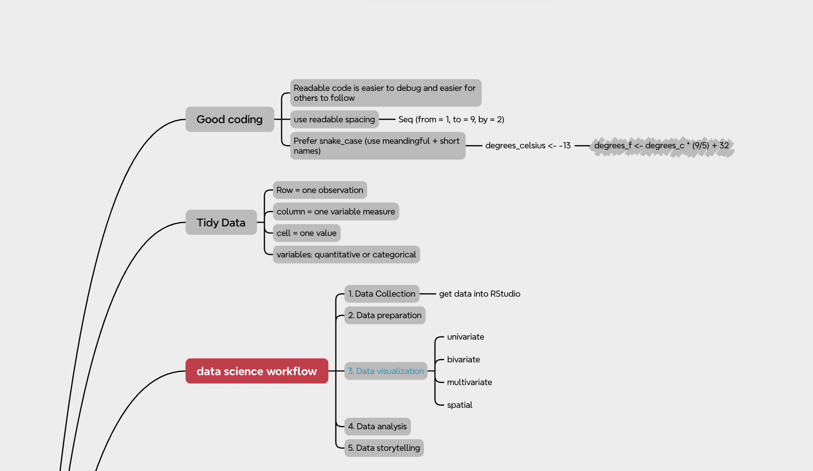
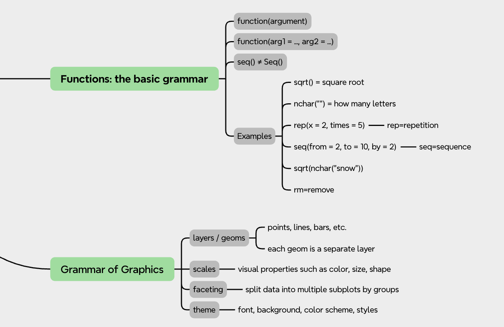
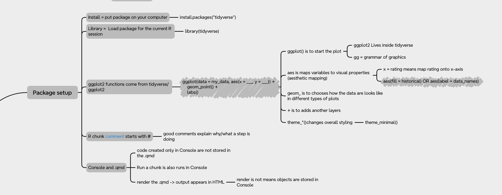
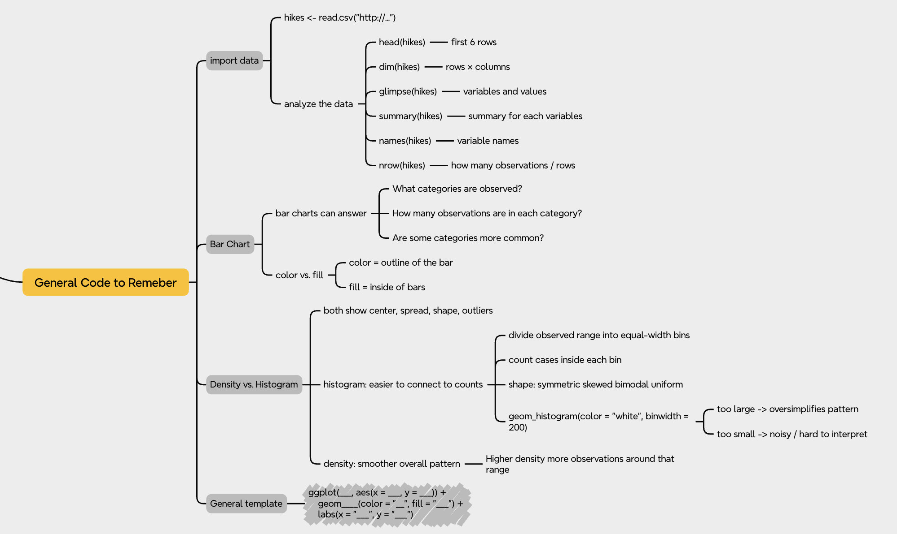
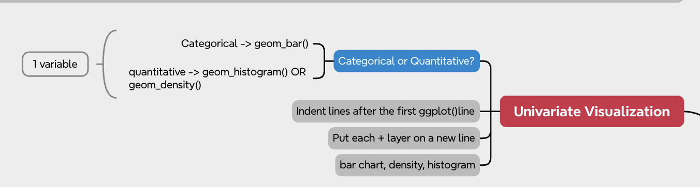
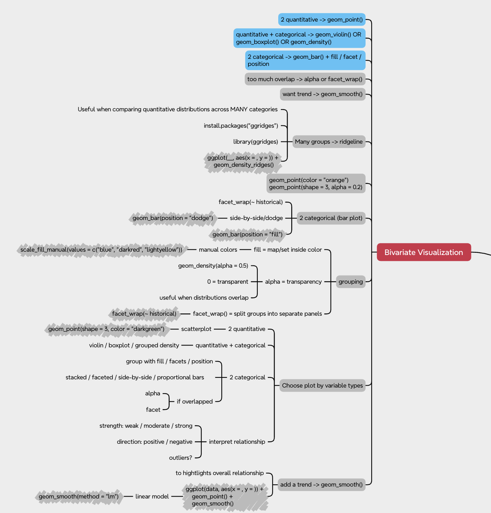
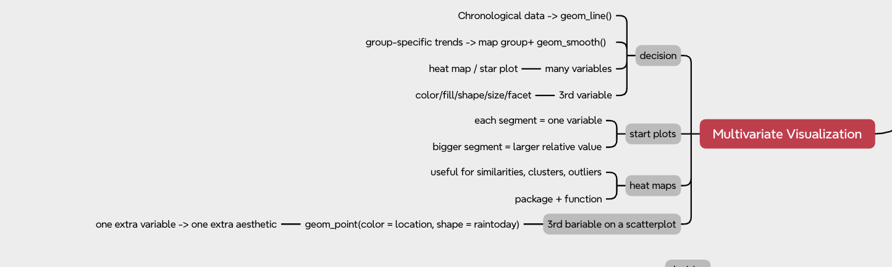
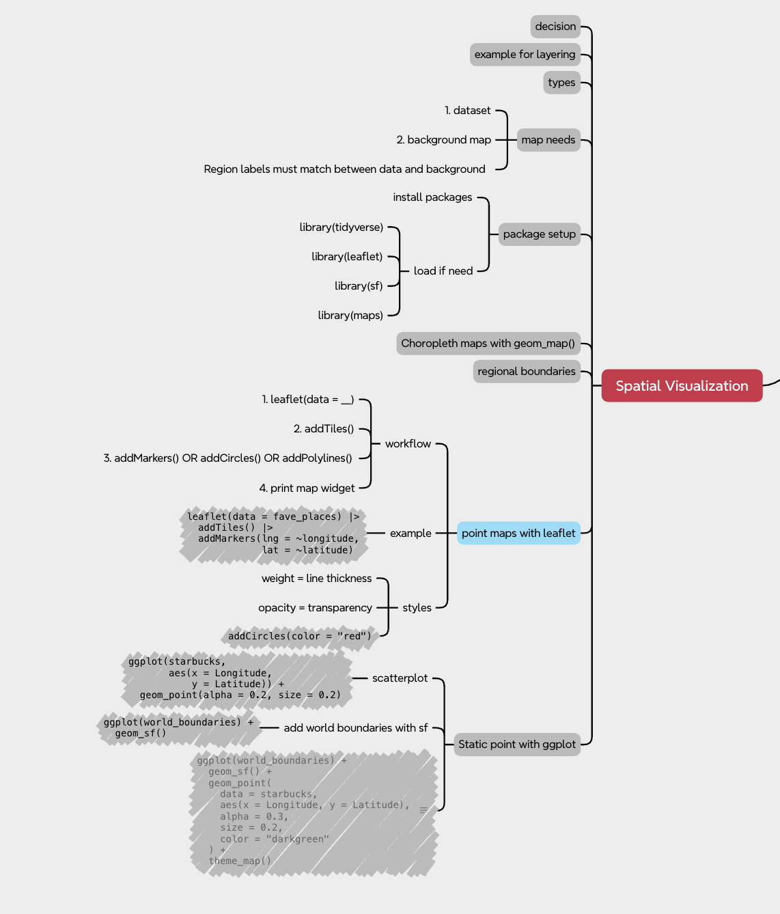

My pre-class learning notes and mind maps from COMP/STAT112.

:::: {.columns .pcl-row}

::: {.column width="55%"}

{.pcl-image}

:::

::: {.column .pcl-text-box .pink-box width="45%"}

## Data Science Workflow

Notes on the overall process of working with data, from importing and preparing data to visualization, analysis, and communication.

:::

::::

:::: {.columns .pcl-row}

::: {.column .pcl-text-box .blue-box width="45%"}

## Basic R Grammar

A summary of basic R syntax, functions, objects, assignment, and foundational tools used throughout the course.

:::

::: {.column width="55%"}

{.pcl-image}

:::

::::

:::: {.columns .pcl-row}

::: {.column width="55%"}

{.pcl-image}

:::

::: {.column .pcl-text-box .yellow-box width="45%"}

## Packages & Setup

Notes on installing packages, loading libraries, working in RStudio, and understanding how packages such as ggplot2 are used.

:::

::::

:::: {.columns .pcl-row}

::: {.column .pcl-text-box .green-box width="45%"}

## General Code

A collection of R functions and commands that became especially useful throughout the semester.

:::

::: {.column width="55%"}

{.pcl-image}

:::

::::

:::: {.columns .pcl-row}

::: {.column width="55%"}

{.pcl-image}

:::

::: {.column .pcl-text-box .purple-box width="45%"}

## Univariate Visualization

Ways to understand and visualize one variable using tools such as bar charts, histograms, and density plots.

:::

::::

:::: {.columns .pcl-row}

::: {.column .pcl-text-box .orange-box width="45%"}

## Bivariate Visualization

Approaches for examining relationships between two variables depending on whether the variables are categorical or quantitative.

:::

::: {.column width="55%"}

{.pcl-image}

:::

::::

:::: {.columns .pcl-row}

::: {.column width="55%"}

{.pcl-image}

:::

::: {.column .pcl-text-box .pink-box width="45%"}

## Multivariate Visualization

Using color, shape, size, faceting, and other visual elements to explore several variables at the same time.

:::

::::

:::: {.columns .pcl-row}

::: {.column .pcl-text-box .blue-box width="45%"}

## Spatial Visualization

Notes on geographic data, maps, spatial layers, Leaflet, and static spatial visualization with ggplot.

:::

::: {.column width="55%"}

{.pcl-image}

:::

::::
